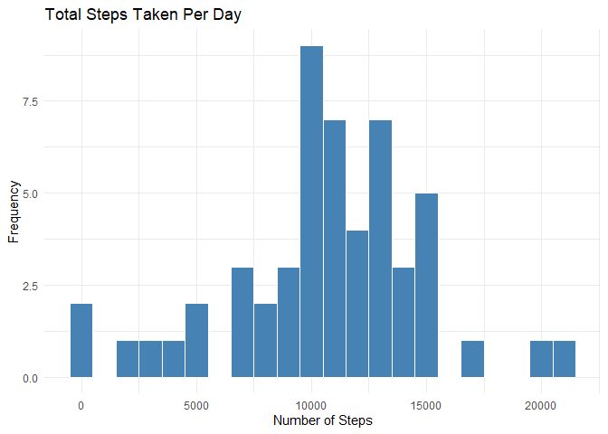
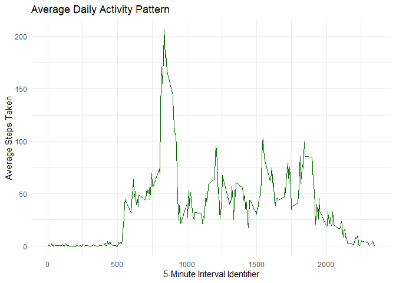
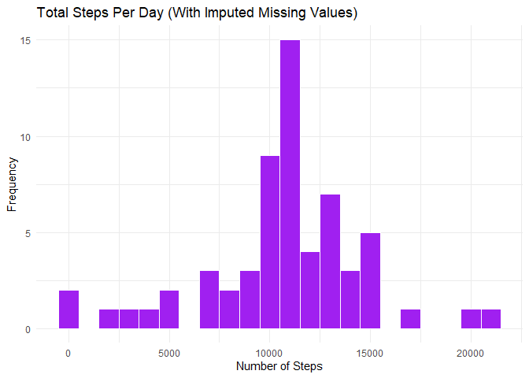
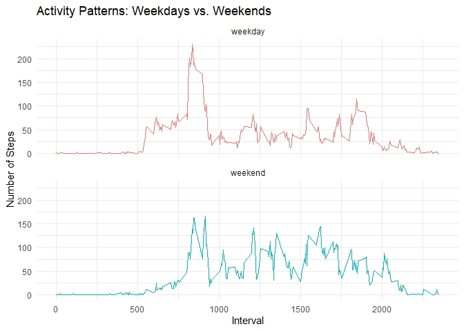

## Loading and prepossessing the data
First, we will load the required libraries, unzip the data file included in the repository, and read the CSV file into a data frame. We will also convert the `date` column into a proper Date format.


``` r
library(dplyr)
library(ggplot2)

# Unzip and read data
if(!file.exists("activity.csv")){
    unzip("activity.zip")
}
activity <- read.csv("activity.csv")

# Transform date column to Date class
activity$date <- as.Date(activity$date, format = "%Y-%m-%d")
```


## What is mean total number of steps taken per day?
For this section, missing values (`NA`) are ignored. 

1. **Calculate the total number of steps taken per day:**

``` r
total_steps_per_day <- activity %>%
    filter(!is.na(steps)) %>%
    group_by(date) %>%
    summarise(total_steps = sum(steps))
```

2. **Histogram of the total number of steps taken each day:**

``` r
ggplot(total_steps_per_day, aes(x = total_steps)) +
    geom_histogram(binwidth = 1000, fill = "steelblue", color = "white") +
    labs(title = "Total Steps Taken Per Day",
         x = "Number of Steps",
         y = "Frequency") +
    theme_minimal()
```

<!-- -->

3. **Calculate and report the mean and median of the total number of steps taken per day:**

``` r
mean_steps <- mean(total_steps_per_day$total_steps)
median_steps <- median(total_steps_per_day$total_steps)
```
* **Mean:** 10766.19 steps per day.
* **Median:** 10765 steps per day.


## What is the average daily activity pattern?
1. **Time series plot of the 5-minute interval and the average number of steps taken, averaged across all days:**

``` r
average_daily_activity <- activity %>%
    filter(!is.na(steps)) %>%
    group_by(interval) %>%
    summarise(avg_steps = mean(steps))

ggplot(average_daily_activity, aes(x = interval, y = avg_steps)) +
    geom_line(color = "darkgreen", size = 0.7) +
    labs(title = "Average Daily Activity Pattern",
         x = "5-Minute Interval Identifier",
         y = "Average Steps Taken") +
    theme_minimal()
```

<!-- -->

2. **Which 5-minute interval contains the maximum number of steps?**

``` r
max_interval <- average_daily_activity %>%
    filter(avg_steps == max(avg_steps))
```
The 5-minute interval that contains the maximum number of steps on average is **interval 835** (with an average of 206.17 steps).


## Imputing missing values
1. **Calculate and report the total number of missing values:**

``` r
total_nas <- sum(is.na(activity$steps))
```
There are a total of **2304** missing rows (`NA`s) in the `steps` dataset.

2. **Strategy for filling in missing data:** 
We will replace each missing value (`NA`) with the **mean for that specific 5-minute interval**, which we already calculated in the previous section.

3. **Create a new dataset with missing data filled in:**

``` r
activity_imputed <- activity %>%
    left_join(average_daily_activity, by = "interval") %>%
    mutate(steps = ifelse(is.na(steps), avg_steps, steps)) %>%
    select(-avg_steps)
```

4. **Histogram, Mean, and Median of the imputed dataset:**

``` r
total_steps_imputed <- activity_imputed %>%
    group_by(date) %>%
    summarise(total_steps = sum(steps))

ggplot(total_steps_imputed, aes(x = total_steps)) +
    geom_histogram(binwidth = 1000, fill = "purple", color = "white") +
    labs(title = "Total Steps Per Day (With Imputed Missing Values)",
         x = "Number of Steps",
         y = "Frequency") +
    theme_minimal()
```

<!-- -->

``` r
mean_imputed <- mean(total_steps_imputed$total_steps)
median_imputed <- median(total_steps_imputed$total_steps)
```
* **Imputed Mean:** 10766.19 steps per day.
* **Imputed Median:** 10766.19 steps per day.

### Impact of Imputing Missing Data:
* The original mean was 10766.19 and the imputed mean is 10766.19. They are identical because we imputed missing values using interval means.
* The original median was 10765 and the imputed median shifted slightly to 10766.19 (now matching the mean).
* The primary impact of this strategy is a much taller peak at the center of our histogram distribution, as the missing entire days were populated with standard average daily values.


## Are there differences in activity patterns between weekdays and weekends?
1. **Create a new factor variable with "weekday" and "weekend":**

``` r
activity_imputed <- activity_imputed %>%
    mutate(day_type = ifelse(weekdays(date) %in% c("Saturday", "Sunday"), 
                             "weekend", "weekday"),
           day_type = as.factor(day_type))
```

2. **Panel plot comparing the average number of steps taken per 5-minute interval across weekdays and weekends:**

``` r
average_by_day_type <- activity_imputed %>%
    group_by(interval, day_type) %>%
    summarise(avg_steps = mean(steps))

ggplot(average_by_day_type, aes(x = interval, y = avg_steps, color = day_type)) +
    geom_line(size = 0.7) +
    facet_wrap(~day_type, ncol = 1) +
    labs(title = "Activity Patterns: Weekdays vs. Weekends",
         x = "Interval",
         y = "Number of Steps") +
    theme_minimal() +
    theme(legend.position = "none")
```

<!-- -->
